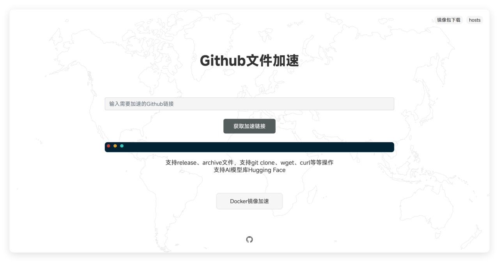

### Docker和Github加速二合一

- 使用`docker`一键部署多种仓库的镜像加速
- 支持`github`文件加速
- 简化搭建步骤
- 部署超级简单
- 自动配置HTTPS
- 拉取的镜像在服务器缓存3天后自动清理（可自行修改）

---

### 使用Docker部署

1：域名解析：将`hub`，`quay`，`ghcr`，`gcr`，`docker`，`k8s`这个几个解析为你的二级域名。

> 嫌麻烦也可以直接泛解析


2：拉取本项目
```
git clone https://github.com/sky22333/hub-proxy.git
```


3：其他无需修改，只需修改`docker-compose.yml`配置里的域名环境变量，修改为你的`根域名`
然后启动即可。

> 这里的`根域名`只是为了动态写入配置和前端，你不用解析，当然也不会影响你的根域名使用。
```
docker compose up -d
```

4：部署完成后稍等几分钟，等待`caddy`帮你把这些域名的HTTPS配置完成后，即可访问`hub.example.com`查看前端

> 可以使用`docker logs -f caddy`命令查看日志获取进度


---
---
---

#### 单独部署Github文件加速
```
docker run -d \
  --name ghproxy \
  -p 5000:5000 \
  --restart always \
  -v $(pwd)/ghproxy:/root/public \
  ghcr.io/sky22333/hub-proxy
```

---
---

### 预览


