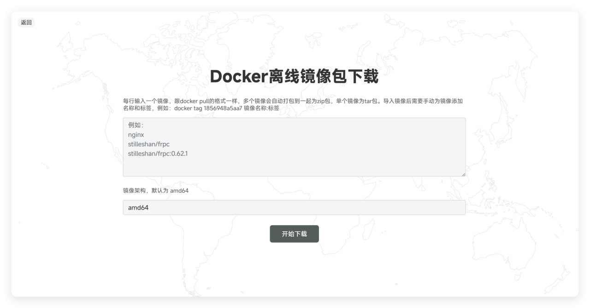

### Docker和Github加速二合一

- 使用`docker`一键部署多种仓库的镜像加速
- `docker`镜像默认缓存3天（可自行修改）
- 支持在线下载`docker`离线镜像包
- 具有自动清理机制
- 支持`github`文件加速
- 支持`api.github.com`
- 支持Al模型库Hugging Face
- 支持IP限流，默认每个IP，每小时20次请求。
- 轻量级，简单方便
- 自动配置HTTPS，默认使用caddy反代，请确保80和443端口没被占用

---

### 使用Docker部署

1：域名解析：将`hub`，`quay`，`ghcr`，`gcr`，`docker`，`k8s`这个几个解析为你的二级域名。

> 嫌麻烦也可以直接泛解析


2：拉取本项目
```
git clone https://github.com/sky22333/hub-proxy.git
```


3：其他无需修改，只需修改`docker-compose.yml`配置里的域名环境变量，修改为你的`根域名`

> 这里的`根域名`只是为了动态写入配置和前端，不用解析，当然也不会影响你的根域名使用。

运行：
```
docker compose up -d
```

4：部署完成后稍等一分钟，等待`caddy`自动配置域名证书后，即可访问`hub.example.com`查看前端

> 可以使用命令`docker logs -f caddy`查看日志获取进度


---
---
---

#### 单独部署Github文件加速（可选）
```
docker run -d \
  --name ghproxy \
  -p 5000:5000 \
  --restart always \
  ghcr.io/sky22333/hub-proxy
```

---
---

### 预览





---

#### 鸣谢：

ghproxy基于go语言的Gin框架，镜像加速基于`registry`镜像实现

前端借鉴了[这个项目](https://github.com/WJQSERVER-STUDIO/ghproxy)的UI，ghproxy后端基于[这个项目](https://github.com/moeyy01/gh-proxy-go)修改并增加了更多特性


### 免责声明

* 本程序完全开源并且仅供学习了解，请勿下载非法文件，使用本项目即默认接受此条款。
* 使用本程序必循遵守部署免责声明。使用本程序必循遵守部署服务器所在地、所在国家和用户所在国家的法律法规, 程序作者不对使用者任何不当行为负责。
